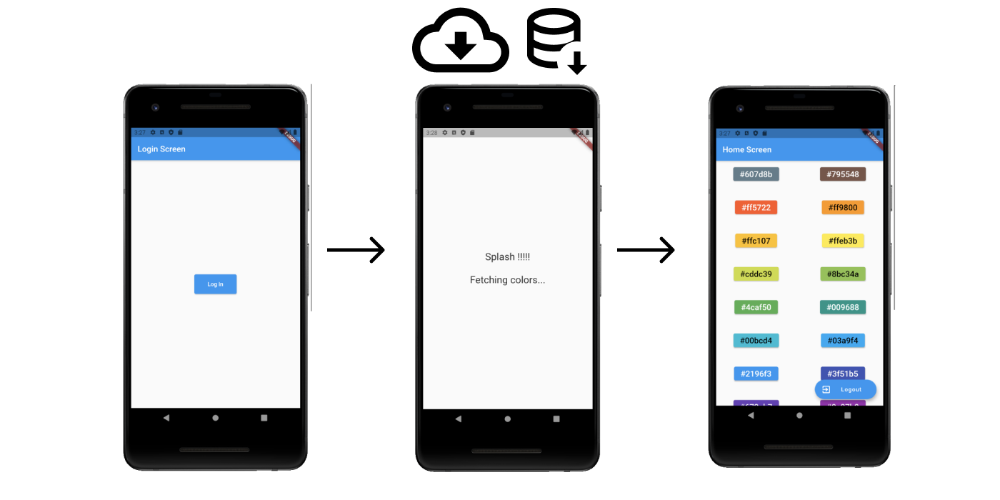

<h1 align="center">ATIVIDADES DESENVOLVIDAS NO CURSO DA ACADEMIA DO FLUTTER</h1>

 Flutter ( Mão na massa).

### » TÓPICOS ESTUDADOS E CONSOLIDADOS:

- Navegação customizada e utilizando o obsever;
- Usando o await para aguardar o retorno de dados de uma página;
    

### Autor

